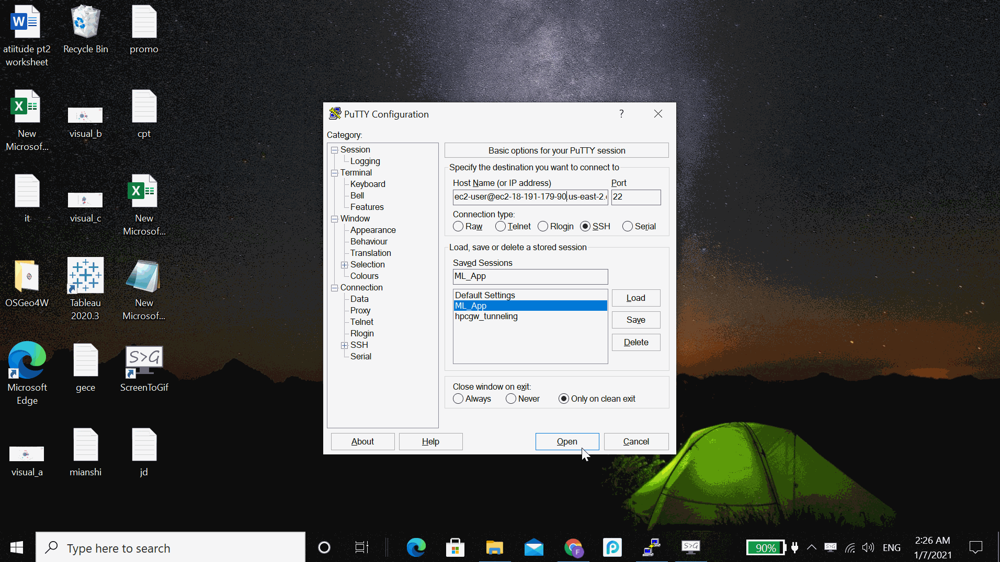

# Machine Learning Web App
Created by Frank Jiang


 ---
 ### Table of Contents
   - [Getting Started](#Getting-Started)
   - [Description](#Description)
   - [Feature](#Feature)
   - [Support Algorithm](#Support-Algorithm)
   - [Model Deployment](#Model-Deployment)
   - [file structure](#file-structure)
   - [Resources](#Resources)
 ---
 
 ## Getting Started
 
 Run the following commands in order to start your machine learning App:
 
 ```console
 streamlit run Main_App.py
```
 
 ## Description
 
 ### Background
 Have you ever wanted to learn machine learning but don't know where to start? Have you wanted to evaluate and 
 choose what algorithm to use but tired of the entire model pipeline building? Machine Learning has become more
 and more popular in the industry for predicting outcomes and exploring important features in the dataset. However,
 it could be tedious and requires coding experience to customize a pipeline for models using different algorithms. 
 Thus, this machine learning web app was designed for automation machine learning using common algorithm and providing
 evaluation metrics and visualization. 
 
 ## Feature
 This web app is designed to be a basic framework that supports all the following features. 
 
 -  Data Loading from Local Computer & Exploration in Browser
 -  Target Variables(Outcome) Selection
 -  Select Machine Learning Algorithm & Auto Model Generation
 -  Parameter Searching
 -  Evaluation Metrics & Visualization
 
 ## Support Algorithm
 
 This machine learning web app currently supports most algorithm from the 'sklearn' library in Python as well as 
 some of the most commonly used algorithm such as Random Forest, Gradient Boosting, Extreme Gradient Boosting, SVM, Kmeans, Naive Bayes.  
 Deep Learning Algorithm 'keras', 'CNN', 'RNN' is currently under development.
 
 ## Model Deployment
 
 ### Framework
 Front-Back End are deployed with Streamlit. Streamlit is an open-source platform that provides solution for 
 fast deploying, managing, sharing, and managing web editing. 
 
 This web app is currently hosted on Amazon AWS Elastic Computing(EC2). The deployment process took no longer 
 than 15 mins.
 
 
 
 ### Requirements
 
 This Web App requires the following library to be installed in order to run properly.
 
 You will need Python 3.x or later to run Main_App. You can have multiple versions of python installed on the same system
 without problems.
 
    $ sudo install python3 python3-pip
  
 You will also need to install 'streamlit','matplotlib', 'sklearn','xgboost','lightgbm','pandas','seaborn','mlxtend'. 
 All can installed via Pip
 
    $ pip install streamlit
    $ pip install matplotlib
    ......
 
 
 ## File Structure
      
    .
    | --- .idea                                   #Required development files
    | --- datasets                                #test dataset file
    |     |--- heart.csv                          #test datset
    | --- static                                  #Static Files that are used during development
    |     |--- background_1.jpg
    |     |--- background_2.jpg
    |     |--- background_3.jpg
    |     |--- background_4.jpg
    |     |--- sidebar.jpg
    |     |--- sidebar_2.jpg
    |     |--- sidebar_3.jpg
    | --- App_Interface.gif                       # App Interface Demo
    | --- Deploy_AWS.gif                          # AWS Deployment Demo
    | --- License
    | --- Main_App.py                             # Main App
    | --- README.md  
    
    
 ## Resource
 
 Streamlit: https://www.streamlit.io/
 
 AWS EC2: https://docs.aws.amazon.com/ec2/index.html
 
 